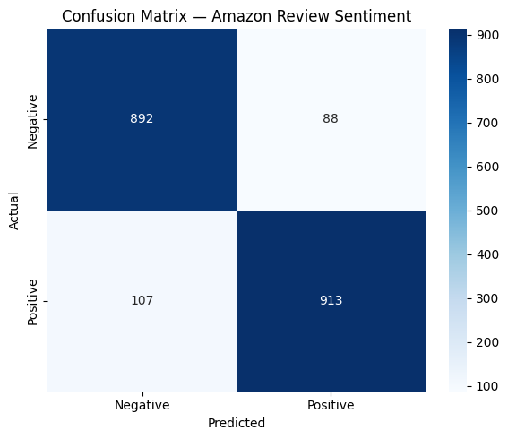
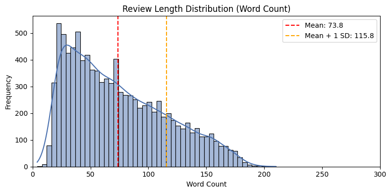
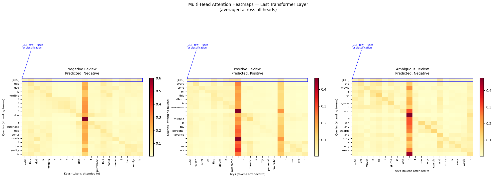
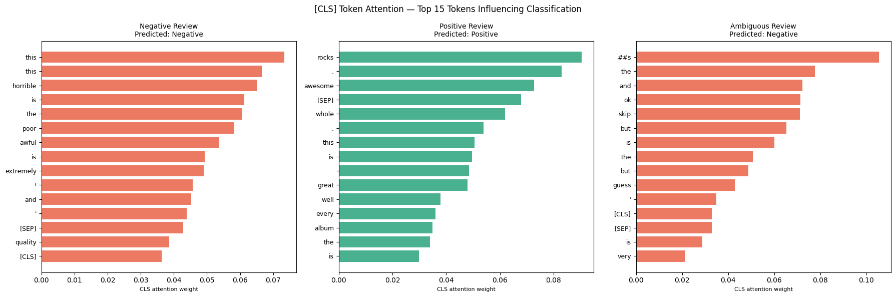

# Amazon Review Sentiment Classifier

Fine-tuned DistilBERT on Amazon product reviews for binary sentiment classification.  
**Test Accuracy: 90% | F1-Score: 0.90 | Training Time: ~6.5 minutes on T4 GPU**

---

## Overview

This project fine-tunes DistilBERT on a 10,000-sample subset of the
[amazon_polarity](https://huggingface.co/datasets/fancyzhx/amazon_polarity)
dataset (3.6M reviews) to classify customer reviews as positive or negative.
The goal was to build a production-aware NLP pipeline with principled
hyperparameter choices, EDA-driven preprocessing decisions, and interpretability
analysis via attention visualization.

Built in one day as a focused ML project by Afrin Munshi, B.Tech EE, IIT Kharagpur.

---

## Results

| Metric | Negative | Positive | Overall |
|--------|----------|----------|---------|
| Precision | 0.89 | 0.91 | 0.90 |
| Recall | 0.91 | 0.90 | 0.90 |
| F1-Score | 0.90 | 0.90 | 0.90 |
| Accuracy | — | — | **90%** |

**Confusion Matrix:**



- 1,805 / 2,000 test reviews correctly classified
- Near-symmetric error distribution (88 false positives, 107 false negatives)
confirms no class prediction bias

---

## Model & Architecture

| Component | Choice | Justification |
|-----------|--------|---------------|
| Base model | DistilBERT-base-uncased | 40% smaller than BERT, 97% performance retained |
| Parameters | 66M | Efficient for fine-tuning on limited data |
| Max length | 256 tokens | Covers p99 of review lengths (EDA-derived) |
| Task head | Linear classifier (2 classes) | Randomly initialized, trained from scratch |

**Why DistilBERT over BERT?**  
DistilBERT (Sanh et al., 2019) retains 97% of BERT's language understanding
at 40% fewer parameters and 60% faster inference. For sentiment classification
on short-to-medium reviews, this tradeoff is clearly favorable — full BERT
would add cost with no meaningful accuracy gain on this task.

---

## Hyperparameters

| Parameter | Value | Justification |
|-----------|-------|---------------|
| Learning rate | 2e-5 | Standard fine-tuning range for transformers; avoids catastrophic forgetting |
| Epochs | 3 | Convergence observed within 3 epochs on 10K samples |
| Batch size | 16 | Fits T4 GPU memory at max_length=256 |
| Weight decay | 0.01 | L2 regularization to reduce overfitting on small subset |
| Eval strategy | Per epoch | Enables early stopping via best checkpoint selection |

---

## EDA Highlights

- Dataset is perfectly balanced — 5,000 negative and 5,000 positive samples in training subset
- Mean review length: **73.8 words**, std dev: **42.0 words**
- p99 word count: 174 words → ~209 tokens after subword tokenization (1.2× factor) → `max_length=256`
- Negative reviews tend to use absolute language ("worst", "never", "completely")
while positive reviews use comparative and enthusiastic language ("better than", "love", "perfect")



---

## Attention Visualization

Multi-head attention weights from the last transformer layer were extracted
and averaged across all heads to interpret which tokens most influenced
the classification decision.




**Key findings:**
- **Negative review:** [CLS] attention concentrates on "horrible", "poor",
"awful", "extremely" — strongly negative content words dominate
- **Positive review:** Attention focuses on "rocks", "awesome", "great" —
the three most emotionally charged tokens, with near-zero weight on punctuation
- **Ambiguous review:** Attention is diffuse across structural tokens;
"but" appears twice in the top 15, suggesting the model has learned
contrast conjunctions as sentiment-conflict signals
- Punctuation and function words receive consistently low [CLS] attention
across all three reviews, confirming the model prioritizes content-bearing tokens

---

---

## Setup & Reproduction

```bash
# All dependencies
pip install transformers datasets accelerate torch scikit-learn matplotlib seaborn
```

Open `amazon_review_sentiment.ipynb` in Google Colab, connect a T4 GPU runtime,
and run all cells top to bottom. Full training completes in ~6.5 minutes.

---

## What I Learned

1. **EDA should drive preprocessing decisions** — using percentile analysis
to justify `max_length=256` rather than defaulting to 128 meaningfully
reduced information loss with negligible compute cost.

2. **Attention visualization reveals model behavior beyond accuracy numbers** —
the diffuse attention pattern on the ambiguous review, and the concentration
on contrast conjunctions like "but", gave genuine insight into how the model
handles sentiment conflict that metrics alone cannot capture.

3. **Fine-tuning is sensitive to learning rate** — pretrained transformer
weights require careful learning rates (1e-5 to 5e-5) to avoid catastrophic
forgetting of pretrained representations while still adapting to the task.

---

## References

- Sanh et al. (2019). [DistilBERT, a distilled version of BERT](https://arxiv.org/abs/1910.01108)
- Zhang et al. (2015). [Character-level Convolutional Networks for Text Classification](https://arxiv.org/abs/1509.01626) (amazon_polarity original paper)
- HuggingFace Transformers documentation

---

*Built by Afrin Munshi — B.Tech (Hons.) Electrical Engineering, IIT Kharagpur*
